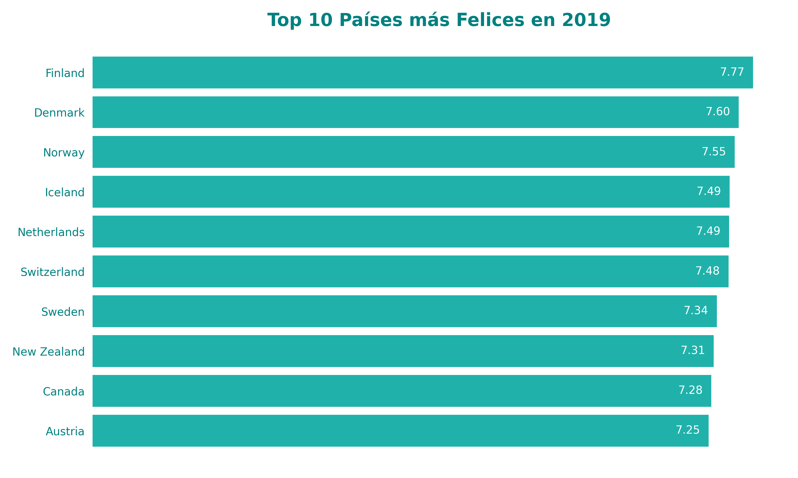
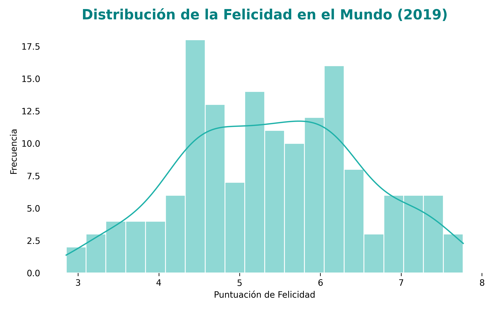
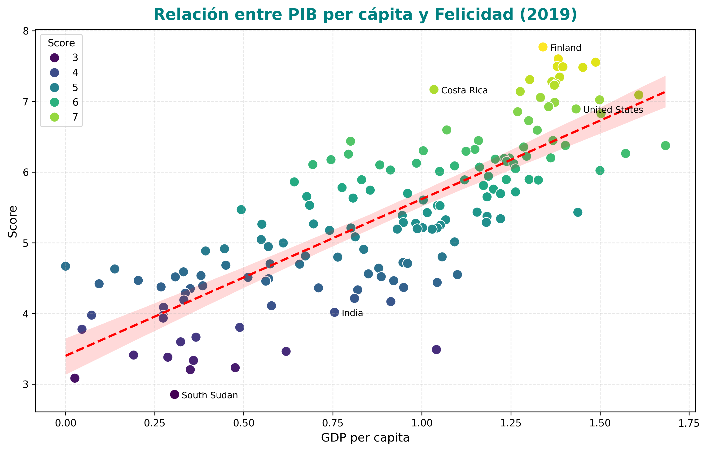

# Análisis del Informe Mundial de la Felicidad 2019

## Integrantes:
- Yamile Calderon
- Ruben Baltazar B.
- Never Adrian
- Roberto Olguin
- Ivan Mamani

---

# Ejercicio en clase
Este proyecto presenta un análisis visual y exploratorio del **Informe Mundial de la Felicidad 2019** utilizando datos disponibles en Kaggle. Se realizaron diferentes gráficos para comprender la distribución y los factores que influyen en la felicidad a nivel global.

## Datos

- Fuente: [World Happiness Report 2019](https://www.kaggle.com/datasets/unsdsn/world-happiness)
- Variables principales utilizadas:
  - `Country` (país)
  - `Score` (puntuación de felicidad)
  - `GDP per capita` (PIB per cápita)

## Gráficos

### 1. Top 10 Países Más Felices (Gráfico de Barras Horizontales)

- Muestra los 10 países con mayor puntuación de felicidad.
- Permite visualizar claramente qué países lideran en bienestar y felicidad en 2019.
- Países predominantemente nórdicos, europeos y algunos anglófonos desarrollados.

### 2. Distribución de la Felicidad Mundial (Histograma)

- Representa la distribución de la puntuación de felicidad para todos los países.
- Utilización del parámetro `bins=20` para observar detalles de la distribución.
- Ayuda a entender cómo se agrupan los países en torno a niveles de felicidad.

### 3. Relación entre PIB per Cápita y Felicidad (Gráfico de Dispersión)

- Visualiza la relación entre riqueza económica (`GDP per capita`) y felicidad (`Score`).
- Permite identificar tendencias y excepciones en la correlación entre dinero y bienestar.

## Personalización de los Gráficos

- Cada gráfico incluye título descriptivo.
- Etiquetas explícitas para ejes X e Y.
- Tamaño de figura ajustado para evitar solapamientos.
- Colores personalizados para mejor visualización.
- Guardado de imágenes localmente (`plt.savefig`).

## Preguntas de Análisis y Respuestas

### Observando el gráfico de barras (Top 10):

- **Patrón geográfico o regional:**  
  Predominan países nórdicos y europeos, además de países anglófonos desarrollados como Nueva Zelanda y Canadá, indicando que la felicidad se concentra en regiones con economías desarrolladas y sistemas sociales sólidos.

- **Factores no medidos:**  
  Más allá del PIB, factores como estabilidad política, confianza en instituciones, igualdad social, servicios públicos de calidad, bienestar comunitario y calidad de vida son claves para la felicidad.

### Analizando el histograma (Distribución de la felicidad):

- **Forma de la distribución:**  
  Aproximadamente unimodal y simétrica, con un pico entre 5 y 6 puntos.

- **Agrupación de países:**  
  La mayoría se agrupa en torno a un valor central (5-6), con pocos en extremos de muy alta o baja felicidad.

- **Calificación de la felicidad mundial:**  
  "Generalmente media" o "moderadamente alta", dado que no hay mucha polarización.

### Interpretando el gráfico de dispersión (PIB vs. Felicidad):

- **Relación entre PIB per cápita y felicidad:**  
  Relación positiva clara, pero no perfectamente lineal.

- **Fuerza de la relación:**  
  Moderadamente fuerte, aunque con dispersión.

- **Tipo de relación:**  
  No lineal; felicidad aumenta rápido al principio con el PIB y luego se estabiliza (rendimientos decrecientes).

- **Excepciones:**  
  Países como Costa Rica tienen alta felicidad con PIB bajo; otros con alto PIB tienen felicidad menor a la esperada.

## Conclusión General

La felicidad mundial en 2019 está fuertemente correlacionada con el desarrollo económico, aunque no depende exclusivamente del PIB per cápita. Los países más felices son aquellos con economías desarrolladas y sistemas sociales sólidos, donde la calidad de vida, confianza social y estabilidad política son determinantes fundamentales. La mayoría de los países presentan niveles moderados de felicidad, y aunque el dinero influye positivamente, factores sociales y culturales juegan un papel esencial. La felicidad global refleja un equilibrio entre bienestar material y factores intangibles de calidad de vida.

¡Gracias por revisar este análisis!

